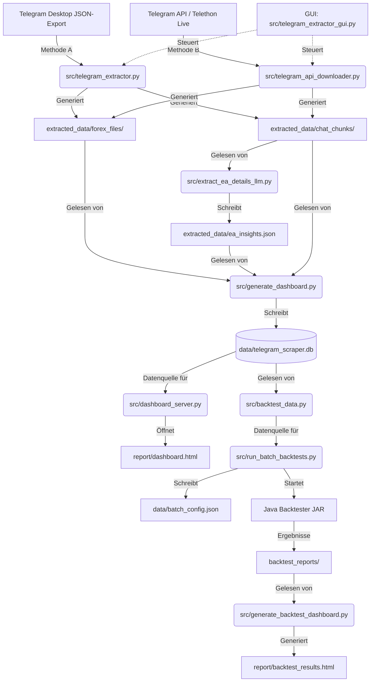

# 📊 Telegram Chat & Forex File Extractor

Dieses Projekt ist eine spezialisierte Komplettlösung zum automatisierten Herunterladen, Strukturieren und Analysieren von Telegram-Chats. Es wurde entwickelt, um Forex-Community-Diskussionen auszuwerten, Empfehlungen für **Expert Advisors (EAs)** (Handelsroboter) zu sammeln, die entsprechenden Programmdateien zu katalogisieren und vollautomatische Backtests über einen Java-Backtester-Service durchzuführen.

Mit der integrierten grafischen Benutzeroberfläche (GUI) können auch technisch nicht versierte Anwender Chats offline importieren oder live über die offizielle Telegram-API herunterladen. Für Entwickler bietet das Projekt strukturierte Datenströme, automatisierte LLM-Analysen, ein interaktives Web-Dashboard und einen vollautomatischen Backtest-Workflow.

---

## 🗺️ Systemarchitektur & Datenfluss

Der Datenfluss gliedert sich in vier Hauptphasen: **Datenbeschaffung**, **LLM-Analyse**, **Dashboard-Generierung** und **Batch-Backtesting**.



---

## 📂 Verzeichnisstruktur des Projekts

```text
TelegramScraper/
├── data/
│   ├── telegram_scraper.db            # Zentrale SQLite-Datenbank (gitignored)
│   └── batch_config.json              # Generierte Backtest-Konfiguration (gitignored)
├── extracted_data/                    # Standard-Ausgabeverzeichnis der Extraktoren
│   ├── chat_chunks/                   # LLM-optimierte Textausschnitte (500 Nachrichten/Chunk)
│   ├── forex_files/                   # Unsortierte Rohdaten-Sammlung aller Forex-Dateien
│   ├── ea_insights.json               # LLM-Analyse-Ergebnisse (Timeframes, Pairs, Risiko)
│   ├── forex_report.csv               # CSV-Tabelle für Excel / Google Sheets
│   └── forex_report.md                # Markdown-Tabelle aller extrahierten Dateien
├── log/
│   └── telegram_scraper.log           # Zentrales Logfile (gitignored)
├── report/
│   ├── dashboard.html                 # Interaktives Roboter-Dashboard (Frontend)
│   ├── dashboard.js                   # Dashboard-Logik
│   ├── backtest_results.html          # Backtest-Ergebnis-Dashboard (generiert)
│   └── robots/                        # Durch Subroutine organisierte EAs
│       └── Name_des_EA/
│           ├── beschreibung.md
│           ├── setup_file.ex5
│           └── settings.set
├── src/                               # Quellcode-Verzeichnis (Python)
│   ├── analyze_organize.py            # Subroutine zur EA-Katalogisierung
│   ├── backtest_data.py               # Geteilte Datenzugriffs-Hilfsfunktionen
│   ├── dashboard_server.py            # Lokaler HTTP-Server + Pipeline-API
│   ├── extract_ea_details_llm.py      # LLM-Analyse-Pipeline (OpenRouter)
│   ├── find_new_robots.py             # Hilfstool: Neue EAs entdecken
│   ├── generate_backtest_dashboard.py # Backtest-Ergebnis-Dashboard-Generator
│   ├── generate_dashboard.py          # Haupt-Dashboard-Generator (→ SQLite)
│   ├── run_batch_backtests.py         # Batch-Backtest-Orchestrator
│   ├── telegram_api_downloader.py     # Telethon-API-Download-Engine
│   ├── telegram_extractor.py          # Offline-JSON-Parser-Engine
│   ├── telegram_extractor_gui.py      # Tkinter-basierte Benutzeroberfläche
│   └── test_extractor.py              # Automatisierte Testsuite
├── config.example.json                # Sichere Beispielkonfiguration (keine echten Keys!)
├── config.local.json                  # Lokale Voreinstellungen (gitignored – NICHT committen!)
├── requirements.txt                   # Python-Abhängigkeiten
├── start.bat                          # Windows-Schnellstart für GUI
└── README.md                          # Dieses Dokument
```

---

## 🎛️ Die technischen Komponenten im Detail

### 1. `src/telegram_extractor_gui.py` (Benutzeroberfläche)
*   **Technologie**: Python Tkinter mit `ttk`-Styles und Windows-DPI-Awareness.
*   **Tab-Struktur**: Methode A (Offline), Methode B (Online-API) und Backtest-Tab in getrennten Ansichten.
*   **Hintergrund-Threading**: Alle rechen- oder netzwerkintensiven Prozesse laufen in Hintergrund-Threads ab.
*   **Modale Dialoge**: Thread-sichere Tkinter-Popups für Bestätigungscode und 2FA-Passwort.
*   **Abhängigkeiten-Installation**: Bietet bei fehlender `telethon`-Bibliothek eine automatische Pip-Installation per Klick.
*   **Backtest-Integration**: Der Backtest-Tab liest Roboter direkt aus `data/telegram_scraper.db` (dieselbe Quelle wie `run_batch_backtests.py`).

### 2. `src/telegram_extractor.py` (Methode A: JSON Parser)
*   **Funktion**: Analysiert offline den JSON-Export (`result.json`) aus Telegram Desktop.
*   **Kollisionsschutz**: Dateien mit demselben Namen werden mit ihrer Nachrichten-ID versehen (z. B. `default_msg1209.set`).
*   **Textbereinigung**: Baut Telegram-Nachrichtenobjekte in saubere, unformatierte Strings um.

### 3. `src/telegram_api_downloader.py` (Methode B: API Downloader)
*   **Technologie**: `telethon` (Asynchroner Telegram-Client).
*   **Chronologie**: Lädt Nachrichten mit `reverse=True` – von **alt nach neu**. Chunks sind dadurch **global chronologisch** sortiert.
*   **API-Daten**: Credentials kommen aus der GUI-Eingabe, `config.local.json` oder den Umgebungsvariablen `TELEGRAM_API_ID` / `TELEGRAM_API_HASH`. Echte Zugangsdaten werden **nie** im Code hinterlegt.

### 4. `src/extract_ea_details_llm.py` (LLM-Analyse-Pipeline)
*   **Funktion**: Analysiert Telegram-Postings zu jedem EA mit einem LLM über [OpenRouter](https://openrouter.ai/).
*   **Ergebnisse**: Extrahiert Timeframes, Währungspaare, Strategie, Risiko und Community-Warnungen pro EA.
*   **Caching**: Schreibt Ergebnisse iterativ nach `extracted_data/ea_insights.json` – bei Abbruch wird beim nächsten Start fortgesetzt.
*   **Konfiguration**: API-Key und Modell werden aus `config.local.json` oder `OPENROUTER_API_KEY` geladen. Standard-Modell: `meta-llama/llama-3.1-8b-instruct` (kostenlos bei OpenRouter).
*   **Limit-Option**: `--limit N` beschränkt die Analyse auf die N meistdiskutierten EAs.

### 5. `src/generate_dashboard.py` (Dashboard-Generator)
*   **Funktion**: Liest Chat-Chunks, LLM-Insights und Forex-Dateien – führt Sentiment-Analyse, Symbol/Timeframe-Extraktion und EA-Scoring durch.
*   **Datenbank**: Schreibt alle Ergebnisse in `data/telegram_scraper.db` (SQLite, Tabellen: `robots`, `robot_files`, `robot_comments`).
*   **Score-System**: Berechnet einen Score (15–95) basierend auf positiven/negativen Community-Kommentaren. Scam-EAs erhalten automatisch Score 30.

### 6. `src/dashboard_server.py` (Lokaler Dashboard-Server)
*   **Funktion**: Startet einen HTTP-Server auf Port 8000 und öffnet `report/dashboard.html` automatisch im Browser.
*   **REST-API**: Stellt folgende Endpunkte bereit:
    *   `GET /api/robots` – Paginierte, filterbare, sortierbare Roboter-Liste aus SQLite
    *   `GET /api/stats` – Übersichts-Statistiken
    *   `GET /api/pipeline/run?step=<id>` – Startet einen Pipeline-Schritt (oder `step=all`)
    *   `GET /api/pipeline/state` – Aktueller Pipeline-Status mit Progress
    *   `GET /api/pipeline/logs` – Live-Logs der Pipeline
    *   `GET /api/config/save` / `GET /api/config/get` – OpenRouter-Key verwalten
    *   `GET /api/config/test-llm` – Verbindungstest zum konfigurierten LLM
*   **Pipeline-Automatisierung**: 6-stufiger automatischer Workflow:
    1. Telegram-Extraktion
    2. EA-Details Analyse (LLM)
    3. Dashboard-Update (SQLite)
    4. Backtest-Konfiguration (Dry-Run)
    5. Backtest-Lauf (MT5 via Java)
    6. Ergebnis-Dashboard generieren

### 7. `src/backtest_data.py` (Gemeinsame Datenzugriffs-Hilfsfunktionen)
*   **Funktion**: Geteiltes Modul für alle Backtest-bezogenen Datenzugriffe – verwendet von `run_batch_backtests.py`, `telegram_extractor_gui.py` und `generate_backtest_dashboard.py`.
*   **Funktionen**:
    *   `load_backtest_robots_from_db(project_root)` – Lädt Roboter aus `data/telegram_scraper.db`
    *   `resolve_backtest_assets(project_root, robot)` – Findet `.ex5`/`.ex4`/`.set`-Dateien für einen EA
    *   `determine_symbols_list(pairs_str)` – Parst Währungspaare aus einem String
    *   `determine_periods_list(timeframe_str)` – Parst Timeframes aus einem String
    *   `get_backtester_root(project_root)` – Auflösung des Backtester-Pfads (Env → config → Sibling-Folder)

### 8. `src/run_batch_backtests.py` (Batch-Backtest-Orchestrator)
*   **Funktion**: Qualifiziert EAs aus der SQLite-Datenbank nach Score und Verfügbarkeit, erstellt `data/batch_config.json` und startet den Java-Backtester.
*   **Filterung**: Nur EAs mit `score >= --min-score` (Standard: 50) und vorhandener `.ex5`/`.ex4`-Datei werden berücksichtigt. Scam-EAs werden automatisch ausgeschlossen.
*   **Optionen**:
    ```bash
    python src/run_batch_backtests.py --dry-run          # Nur Config generieren, nicht starten
    python src/run_batch_backtests.py --limit 10         # Nur Top-10 EAs
    python src/run_batch_backtests.py --symbol EURUSD    # Alle Tests auf einem Symbol
    python src/run_batch_backtests.py --period H1        # Alle Tests auf einem Timeframe
    python src/run_batch_backtests.py --min-score 70     # Strengerer Score-Filter
    python src/run_batch_backtests.py --model 0          # Every-tick-Modell
    ```

### 9. `src/generate_backtest_dashboard.py` (Backtest-Ergebnis-Dashboard)
*   **Funktion**: Liest alle `summary.txt`-Dateien aus dem Backtester-Berichtsordner und generiert `report/backtest_results.html`.
*   **Features**: Kachel- und Tabellenansicht, Filterung nach Symbol/Timeframe, Sortierung nach Gewinn/Drawdown/Profit Factor, Equity-Curve-Thumbnails mit Modal-Großansicht.
*   **Backtester-Pfad**: Wird über `backtest_data.get_backtester_root()` aufgelöst (portabel).

### 10. `src/analyze_organize.py` (Subroutine)
*   **Funktion**: Durchsucht `chat_chunks/` nach EA-Erwähnungen, vergleicht mit `forex_files/` und sortiert in `report/robots/` ein. Generiert `beschreibung.md` und kopiert `.set`-Dateien.

### 11. `src/test_extractor.py` (Test-Suite)
*   **Funktion**: Erstellt eine isolierte Testumgebung (`test_env/`), erzeugt simulierte EA-Dateien und Test-JSON. Überprüft Chunks, Berichte und Namensfilter.

---

## 🔑 Konfiguration

### `config.local.json` (gitignored – nie committen!)

Erstelle diese Datei im Projektroot basierend auf `config.example.json`:

```json
{
  "phone": "+491701234567",
  "api_id": 12345678,
  "api_hash": "dein-telegram-api-hash",
  "openrouter_api_key": "sk-or-...",
  "openrouter_model": "meta-llama/llama-3.1-8b-instruct",
  "backtester_root": "D:/Pfad/zum/Backtester"
}
```

| Feld | Beschreibung | Alternativ |
|---|---|---|
| `api_id` / `api_hash` | Telegram API-Zugangsdaten | `TELEGRAM_API_ID` / `TELEGRAM_API_HASH` |
| `openrouter_api_key` | API-Key für LLM-Analyse | `OPENROUTER_API_KEY` |
| `openrouter_model` | LLM-Modell bei OpenRouter | – |
| `backtester_root` | Pfad zum Backtester-Projekt | `BACKTESTER_ROOT` (Env-Var) |

> **Pfad-Auflösung für `backtester_root`**: Env-Var `BACKTESTER_ROOT` → `backtester_root` in `config.local.json` → Sibling-Ordner `../Backtester` (Standard)

---

## 💱 Forex-Dateiendungen verstehen

| Dateiendung | Beschreibung | Plattform |
| :--- | :--- | :--- |
| **`.mq4`** | Lesbarer Quellcode (MQL4) | MetaTrader 4 |
| **`.mq5`** | Lesbarer Quellcode (MQL5) | MetaTrader 5 |
| **`.ex4`** | Kompilierter EA / Indikator | MetaTrader 4 |
| **`.ex5`** | Kompilierter EA / Indikator | MetaTrader 5 |
| **`.set`** | Parameter-Preset-Datei | MT4 & MT5 |

---

## 🗄️ Datenbankschema (`data/telegram_scraper.db`)

Die zentrale SQLite-Datenbank ist die gemeinsame Datenquelle für Dashboard-Server, GUI-Backtest-Tab und Batch-Backtester.

```sql
-- Roboter-Tabelle
robots (id TEXT PK, name, strategy, risk, timeframe, pairs, description, mentions, score)

-- Zugehörige Dateien (.ex4, .ex5, .mq4, .mq5, .set)
robot_files (id INT PK, robot_id FK, filename)

-- Positive und negative Community-Kommentare
robot_comments (id INT PK, robot_id FK, comment_text, is_negative INT)
```

---

## 🚀 Installations- und Einrichtungsanleitung

### Voraussetzungen
*   **Python 3.8 oder neuer**
*   Bei Windows: Option **„Add Python to PATH"** bei der Installation aktivieren.

### Installation
```bash
pip install -r requirements.txt
```

---

## 📖 Bedienungsanleitung (Schritt-für-Schritt)

### Dashboard-Server starten (Empfohlen)

```bash
python src/dashboard_server.py
```

Der Browser öffnet sich automatisch unter `http://localhost:8080/report/dashboard.html`. Über das **Pipeline**-Panel im Dashboard können alle Schritte einzeln oder komplett automatisiert ausgeführt werden.

---

### GUI starten (Alternative)

Doppelklick auf **`start.bat`** oder:
```bash
python src/telegram_extractor_gui.py
```

---

### Methode A: Offline JSON-Parser

1.  Öffnen Sie **Telegram Desktop** → Chat → **⋮ Chatverlauf exportieren**.
2.  Format auf **JSON** umstellen, Dateien aktivieren, Größenlimit maximieren.
3.  In der GUI Tab **Methode A** → `result.json` auswählen → **Extraktion starten**.

---

### Methode B: Direkt-Download (Online-Methode)

1.  GUI → Tab **Methode B** → Telefonnummer eingeben.
2.  **1. Anmelden & Chats laden** → Code eingeben (ggf. 2FA-Passwort).
3.  Chat aus Dropdown wählen → **2. Download & Extraktion starten**.

---

### Vollautomatischer Analyse-Workflow (CLI)

```bash
# 1. Dashboard aus Chat-Chunks generieren (→ SQLite-DB)
python src/generate_dashboard.py

# 2. LLM-Analyse für alle EAs (OpenRouter, kostenloses Modell möglich)
python src/extract_ea_details_llm.py --limit 50

# 3. Dashboard mit LLM-Daten neu generieren
python src/generate_dashboard.py

# 4. Backtest-Konfiguration erstellen (Dry-Run)
python src/run_batch_backtests.py --dry-run

# 5. Batch-Backtest starten (benötigt Java-Backtester)
python src/run_batch_backtests.py

# 6. Backtest-Ergebnis-Dashboard generieren
python src/generate_backtest_dashboard.py
```

---

## 🤖 Der KI/LLM-Workflow

### Warum 500 Nachrichten pro Chunk?
Large Language Models haben Begrenzungen bei der Kontextlänge. 500 Nachrichten ist der optimale Kompromiss: klein genug für vollständige Analyse, groß genug um mehrstündige Diskussionen im Kontext zu halten.

### LLM-Modell wählen
Das Standard-Modell `meta-llama/llama-3.1-8b-instruct` ist bei OpenRouter **kostenlos** (15 Anfragen/Minute). Für bessere Qualität kann in `config.local.json` ein anderes Modell eingestellt werden, z. B. `google/gemini-flash-1.5`.

---

## 🛠️ Entwickler-Richtlinien

### Pfadauflösungs-Richtlinie
Verwenden Sie **niemals** `Path.cwd()` für Pfade innerhalb des Projektordners:
```python
# Richtig:
PROJECT_ROOT = Path(__file__).parent.parent.resolve()
log_dir = PROJECT_ROOT / "log"
```

### Log-Richtlinie
Alle `src/`-Skripte schreiben in `log/telegram_scraper.log` via `Tee`-Klasse. Kritische Fehler immer abfangen und mit Timestamp protokollieren.

### Datensicherheit
*   **Niemals** echte API-Keys oder Telegram-Credentials im Code hinterlegen.
*   `config.local.json` ist gitignored – als Template dient `config.example.json`.
*   Vor jedem Commit: Secret-Scan auf `src/` und Dokus durchführen.

### Testgetriebene Entwicklung
```bash
python src/test_extractor.py
```
Alle Tests müssen mit `=== VERIFIZIERUNG ERFOLGREICH ===` abschließen.

### Gemeinsame Datenzugriffs-Module nutzen
Für alle Backtest-bezogenen Daten immer `backtest_data.py` importieren – nie direkt HTML parsen oder Pfade hardcoden:
```python
from backtest_data import load_backtest_robots_from_db, get_backtester_root, resolve_backtest_assets
```
