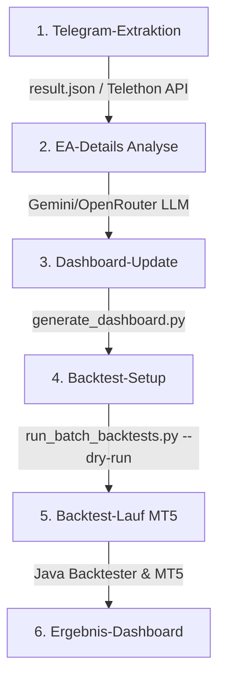

# 🤖 Project Overview & Test Guide (for AI Agents)

This document provides a highly structured technical overview of the **Telegram Chat & Forex Expert Advisor (EA) Cataloging/Backtesting System**. It is designed specifically for AI coding agents to quickly comprehend the codebase architecture, understand how to run tests, and maintain/extend the system.

---

## 🎯 1. Project Objective

The system automates the processing of Telegram chat history to discover, catalog, analyze, and backtest MetaTrader (MT4/MT5) Expert Advisors (EAs). It processes raw chat messages (containing file attachments and discussions) and turns them into a structured database, an interactive web dashboard, and automated MT5 backtests.

---

## 🧭 2. High-Level Architecture & Pipeline Steps

The system runs a **6-step process automation workflow** which can be triggered step-by-step or all at once via the web dashboard.



### Component Breakdown:

1.  **Chat & File Extraction (`src/telegram_extractor.py`, `src/telegram_api_downloader.py`, `src/telegram_extractor_gui.py`)**
    *   **Goal**: Extracts MetaTrader files (`.ex4`, `.ex5`, `.set`) and chat text.
    *   **Heuristics**: Groups messages into chronologically sorted text files (chunks of 500 messages) in `extracted_data/chat_chunks/` containing system prompts, ready to be read by LLMs.
    *   **Collision Prevention**: Appends message IDs to filenames (e.g., `config_msg1452.set`) if names collide, ensuring historical config versions aren't overwritten.

2.  **EA Details Analysis (`src/extract_ea_details_llm.py`)**
    *   **Goal**: Extracts metadata (timeframes, currency pairs, trading strategy, description, risks, scam alerts) from the chat text associated with the EAs.
    *   **Method**: Uses OpenRouter / Gemini LLMs to analyze EAs and output structured data.
    *   **Output**: Appends analysis logs to `log/telegram_scraper.log` under `[LLM_ANALYSIS]` and updates `extracted_data/ea_insights.json`.
    *   **Mapping & Synthesis Details**:
        *   **Keyword Mapping**: Messages are matched against EAs using keyword mapping (e.g., matching "waka waka" or "wakawaka"). A message mentioning multiple EAs is mapped to all matching EAs, preserving comparative context.
        *   **Batch LLM Synthesis**: For each EA, the pipeline takes the last 35 comments, compiles them into a single context, and sends them in a single batch prompt to the LLM (OpenRouter / Gemini). The LLM processes all postings at once to generate a consolidated, validated German summary.
        *   **Cache & Database Import**: The extracted details are cached iteratively in `extracted_data/ea_insights.json`, supporting resuming (starts where it left off, e.g. at 1001 if 1000 are done) and cache resetting. During the dashboard generation, the cached insights are imported into the `robots` table (one row per EA) and individual raw comments are linked in the `robot_comments` table.


3.  **Dashboard Generation (`src/generate_dashboard.py`, `src/dashboard_server.py`)**
    *   **Goal**: Generates a premium dark-mode dashboard (`report/dashboard.html`) and serves it locally.
    *   **Server**: Spawns a custom `ThreadingHTTPServer` to avoid blocking during concurrent requests. Refactored to release thread locks (`pipeline_lock`) *before* issuing network responses, preventing UI/backend deadlocks.

4.  **Backtest Setup (`src/run_batch_backtests.py` with `--dry-run`)**
    *   **Goal**: Analyzes the cataloged EAs and compiles a batch configuration file (`batch_config.json`) listing all qualified EAs, pair parameters, and settings.

5.  **Backtest Run (`src/run_batch_backtests.py`)**
    *   **Goal**: Communicates with MetaTrader 5 (MT5) through a Java-based backtesting automation adapter to run the strategy tester.

6.  **Results Dashboard (`src/generate_backtest_dashboard.py`)**
    *   **Goal**: Aggregates test results and generates `report/backtest_results.html` summarizing performance metrics.

---

## 📂 3. Directory Structure

| Directory / File | Description |
| :--- | :--- |
| `src/` | Holds all core Python modules (GUI, Parsers, LLM client, Servers, Tests). |
| `doc/` | Contains developer guides, system architectures, and user documentation. |
| `report/` | Location of output HTML dashboards and compiled markdown reports. |
| `extracted_data/` | Data folder holding raw `.ex4`/`.ex5`/`.set` files and chat chunks. |
| `config.local.json` | Ignored local config file storing OpenRouter keys & default LLM model choice. |
| `log/` | Workspace logging output path (`telegram_scraper.log`). |
| `start.bat` | Command file to start the desktop Tkinter GUI application. |
| `start_dashboard.bat` | Command file to start the web dashboard server locally. |

---

## ⚙️ 4. Key Configurations & Keys

-   **`config.local.json`**: Located at the project root. Holds sensitive settings.
    ```json
    {
      "openrouter_api_key": "openrouter-api-key-here",
      "openrouter_model": "meta-llama/llama-3.1-8b-instruct"
    }
    ```
-   **Model Choice**: The default model is `meta-llama/llama-3.1-8b-instruct`. It is highly stable, cost-effective ($0.02/1M tokens), and doesn't suffer from the rate limit timeouts common in OpenRouter's free tiers.

---

## 🧪 5. Testing & Verification Guide (For Other AIs)

When testing modifications or additions, execute the following steps in sequence:

### Step 1: Setup & Dependency Validation
Ensure Python 3.8+ is active, and install requirements:
```bash
pip install -r requirements.txt
pip install requests
```

### Step 2: Run Parser Unit/Integration Tests
Verify the core JSON parser and file extractor by running the test suite:
```bash
python src/test_extractor.py
```
**Expected Outcome**: The test script generates mock chat data, runs the extractor, validates output files, deletes the mock files, and exits with:
`=== VERIFIZIERUNG ERFOLGREICH ===`

### Step 3: Run and Verify the Server
Launch the server in the background or terminal:
```bash
python src/dashboard_server.py
```
**Expected Outcome**: The server launches, listens on `http://localhost:8000/`, and generates `[+] [Step 5/5] Dashboard erfolgreich generiert` or logs connection events.

### Step 4: Verify the LLM Connection Endpoint
Verify that the server connection test is functional by querying the API:
```bash
curl http://localhost:8000/api/config/test-llm
```
**Expected Outcome**: If a key is configured, returns a JSON object with `"status": "success"` and the model's response. If no key is set, returns `"status": "error"`.

### Step 5: Verify File Logging
All LLM prompts, replies, processing states, and Python stack tracebacks must log cleanly to `log/telegram_scraper.log`. Check this log after initiating workflows.

---

## 🔒 6. Critical Implementation Rules

1.  **Script-Relative Paths**: Do not use `os.getcwd()` or `Path.cwd()` for file lookups. Always construct paths relative to the executing file:
    `PROJECT_ROOT = Path(__file__).parent.parent.resolve()`
2.  **Thread Safety in Tkinter GUI**: Tkinter handles GUI updates on a single thread. Always feed progress values and logging streams from background threads through `self.log_queue` (a `queue.Queue`) and poll it from the main GUI thread.
3.  **Release Locks Before I/O**: Do not wrap standard network calls (`requests.post`/`fetch`) or HTTP response writes inside lock acquisitions (e.g. `with pipeline_lock`). Copy data objects quickly inside the lock block, release the lock, and perform the I/O.
