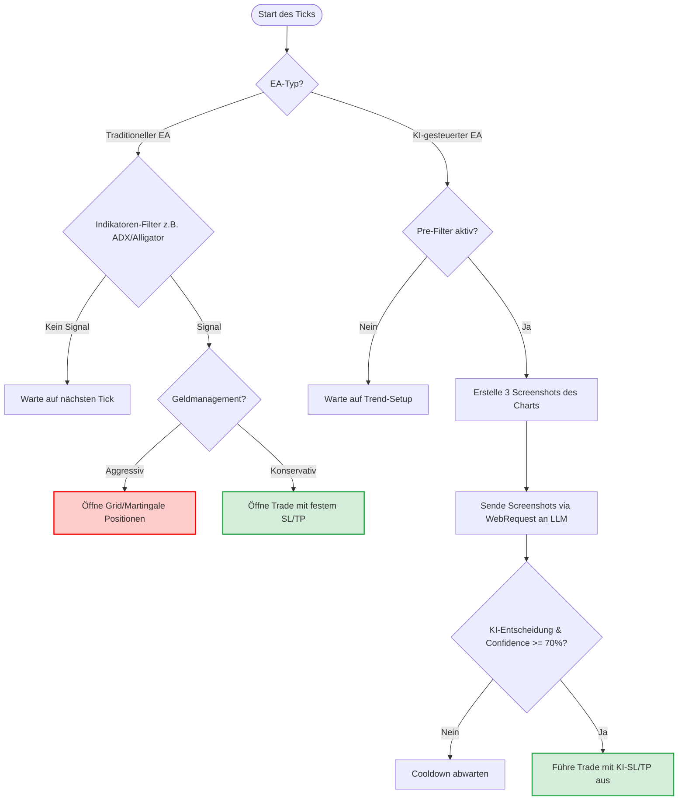

# Ausführlicher Analysebericht: Telegram Forex EA-Community & Bot-Katalog

Dieser Bericht bietet eine umfassende Analyse der Chat-Protokolle des **FXCracked - Group Chat** (Mai bis Juni 2026). Ziel ist es, aus den Diskussionen der Trader-Community die besten Forex-Roboter (Expert Advisors, EAs) herauszufiltern, Risikowarnungen zu dokumentieren, Broker-Mechanismen zu erklären und die bereits heruntergeladenen Dateien zu katalogisieren.

---

## 📊 Inhaltsverzeichnis
1. [Visualisierung: Entscheidungsprozesse der EAs](#1-visualisierung-entscheidungsprozesse-der-eas)
2. [Community-Diskussionsanalyse: Risiken & Warnungen](#2-community-diskussionsanalyse-risiken--warnungen)
3. [Die am besten bewerteten & empfohlenen EAs](#3-die-am-besten-bewerteten--empfohlenen-eas)
4. [Katalog der extrahierten Forex-Dateien](#4-katalog-der-extrahierten-forex-dateien)
5. [Fazit & Praktische Handlungsempfehlungen](#5-fazit--praktische-handlungsempfehlungen)

---

## 1. Visualisierung: Entscheidungsprozesse der EAs

Um den Unterschied zwischen einem traditionellen technischen EA (wie *Quantum Queen* oder *CCBSN*) und einem modernen KI-gesteuerten EA (wie *ForexCracked.com AI*) zu verdeutlichen, zeigt das folgende Diagramm deren grundlegende Funktionsweise:

---

## 2. Community-Diskussionsanalyse: Risiken & Warnungen

Die Community im FXCracked-Chat besteht aus einer Mischung aus Anfängern, erfahrenen Tradern und Codern/Crackern. Folgende Kernthemen wurden intensiv diskutiert:

### ⚠️ Das Martingale- & Grid-Dilemma auf Gold (XAUUSD)
Viele Trader suchen nach dem "Heiligen Gral" für Gold. Die Admins (besonders `@rp4000`) warnen jedoch ununterbrochen davor, Grid- oder Martingale-Bots ohne harten Stop-Loss auf Gold laufen zu lassen.
> [!WARNING]
> *"Only idiots use martingale on GOLD and CRYPTO with no SL. It is 100% gambling, not forex trading."*
> Grid-Systeme können wochenlang Gewinne erzielen ("Holy Grail für 2 Tage"), bis eine starke Trendphase ohne nennenswerte Retracements eintritt und das gesamte Konto in wenigen Stunden liquidiert ("Vanish/Blow").

### 🏎️ Warum Scalping-EAs live oft scheitern
Scalping-Bots versuchen, minimale Ineffizienzen im Bereich von Millisekunden auszunutzen. Im Backtest und auf Demo-Konten sieht die Equity-Kurve oft perfekt aus. Im realen Markt scheitern sie jedoch an:
1. **Slippage:** Die Latenz zwischen dem Signal des EAs und der Ausführung beim Broker führt dazu, dass Positionen zu schlechteren Preisen geöffnet/geschlossen werden.
2. **Spreads:** Zu Zeiten hoher Volatilität oder geringer Liquidität weiten sich die Spreads aus, was den potenziellen Gewinn komplett auffrisst.
Für den erfolgreichen Einsatz eines Scalpers wird ein institutionelles Konto mit extrem geringer Latenz (< 1ms ping zum Broker-Server via VPS) benötigt.

### 🕵️ Vorsicht vor "History Readern"
Einige kommerzielle EAs manipulieren Backtests, indem sie historische Daten direkt im Code auslesen und so im Strategie-Tester fehlerfreie Ergebnisse erzielen. Live versagen diese EAs völlig oder platzieren keine Trades. Verdachtsfälle der Community:
* **BB Return mt5**
* **Goldwave EA** (cracked Versionen nehmen im Live-Betrieb oft keine Trades, weil sie Server-Verifizierungen verlangen).

### 🏢 Broker-Typen: A-Book vs. B-Book
Die Wahl des Brokers entscheidet maßgeblich über den Erfolg automatisierter Strategien:
* **Regulierte A-Book Broker (z. B. ICMarkets, FP Markets, Eightcap, ICTrading):** Leiten die Trades an echte Liquiditätsprovider weiter. Sie verdienen nur an Kommissionen/Spreads und haben kein Interesse daran, dass der Trader verliert.
  > [!NOTE]
  > **AML (Anti-Money Laundering) Richtlinie:** Bei regulierten Brokern können Sie per Krypto oder Karte eingezahltes Geld zwar auf demselben Weg wieder abheben, **Gewinne** müssen jedoch zwingend per Banküberweisung ausgezahlt werden.
* **B-Book / Casino-Broker (z. B. Exness, HFM, OctaFX):** Behalten alle Trades im eigenen Haus. Der Verlust des Trader ist der Gewinn des Brokers. Sie nutzen oft Virtual Dealer Plugins (VDP), um Slippage künstlich zu erzeugen oder Kerzen zu manipulieren. Gewinne können hier oft problemlos per Krypto ausgezahlt werden, da keine echte Marktregulierung stattfindet.

### 🔐 ex5-Dekompilierungs-Scams
ex5-Dateien (MetaTrader 5) sind in Maschinencode (x64 Assembly) kompiliert. Es gibt im Gegensatz zu alten ex4-Dateien keinen automatischen Dekompilierer.
> [!CAUTION]
> Jeder auf Telegram, Fiverr oder Upwork, der behauptet, eine `.ex5`-Datei für wenig Geld (z. B. $240) in eine `.mq5`-Quelldatei umzuwandeln, ist ein **Betrüger**. Das manuelle Reverse Engineering einer ex5-Datei erfordert Hunderte von Arbeitsstunden und entspricht dem Neuschreiben des Programms.

---

## 3. Die am besten bewerteten & empfohlenen EAs

### 1. Quantum Queen (QQ) & Quantum Athena (QA)
* **Konzept:** Trendfolgendes Grid-System für Gold (XAUUSD). QA ist eine fokussierte, leichtere Version von QQ.
* **Einsatz-Empfehlung:** 
  * Mindestens **$500 Kapital für 0.01 Lot** (Standard-Risiko).
  * Ideal auf einem **Cent-Konto** (z. B. Vantage Cent MT5), um das Risiko von Margin Calls bei großen Drawdowns abzufedern.
* **Tipp von `C137`:** Verwenden Sie feste Lotgrößen (z. B. 0.02 Lot pro $5k Kapital) und testen Sie das Set über mindestens 2 Jahre im Tester. QQ v3xx bietet einen deutlich besseren Kontoschutz als ältere Versionen.

### 2. Can Cu Bu Sieng Nang (CCBSN)
* **Konzept:** Hochwertiges Grid-System, besonders optimiert für asiatische Währungspaare.
* **Einsatz-Empfehlung:** 
  * Benötigt mindestens **150k Cent ($1.500 USD)**, um stabil zu laufen.
  * Muss für jedes Währungspaar separat optimiert werden. D3F4ULT nutzt es seit über 4 Monaten profitabel.

### 3. ForexCracked.com AI (AI FREE)
* **Konzept:** Ermöglicht die direkte Anbindung von MT5 an Large Language Models (Claude, GPT, Gemini) über WebRequests. 
* **Einrichtung:**
  1. Freigabe der WebRequest-URLs in MT5 (*Tools -> Options -> Expert Advisors*):
     * `https://api.anthropic.com`
     * `https://api.openai.com`
     * `https://generativelanguage.googleapis.com`
  2. Eigenen API-Key im EA eintragen.
* **Wichtig:** DeepSeek API unterstützt in dieser Version keine Vision-Features (Screenshots), daher müssen Gemini, Claude oder GPT verwendet werden.

### 4. Forex Fury (V3 MT4 / MT5)
* **Konzept:** Ein zeitgesteuerter Scalper, der pro Tag nur in einer bestimmten Stunde aktiv ist, wenn der Markt ruhiger ist.
* **Empfohlene Paare:** EURJPY, USDJPY, GBPJPY auf M5.
* **Einsatz-Empfehlung:** Nutzen Sie ein Demo-Konto, um die exakte Handelsstunde auf die Zeitzone Ihres Brokers anzupassen (Standard: ca. 22:00 Uhr südafrikanische Zeit).

### 5. RoyalGuard (Drawdown-Schutz)
* **Konzept:** Ein reines Risiko-Management-Tool von `@rp4000`. Es handelt nicht selbst, sondern überwacht das Konto und schließt alle Positionen aller EAs, falls ein definiertes Verlustlimit überschritten wird.
* **Empfehlung:** Unbedingt parallel zu riskanten Bots wie *Quantum Queen* laufen lassen!

### 6. WallStreet Recovery PRO & WallStreet Forex Robot
* **Konzept:** Ausbruchs-Scalper mit integriertem intelligenten Verlust-Rückgewinnungs-Management (Advanced Recovery System).
* **Einsatz-Empfehlung:**
  * Timeframe: M15
  * Währungspaare: EURUSD, GBPUSD, USDJPY, AUDUSD, USDCHF, USDCAD, NZDUSD
  * Standardeinstellungen (Default) sind bereits vollständig für alle unterstützten Paare optimiert.
  * Risiko-Rating: 🟠 Mittel (Sicherer als reines Grid/Martingale durch kontrollierte Erholung).

### 7. ToTheMoon (NoPain Signal)
* **Konzept:** Grid-System mit intelligentem Durchschnittspreis-Management (Smart Averaging) und Smart Stop Loss (schließt Verlustpositionen schrittweise).
* **Einsatz-Empfehlung:**
  * Basiert auf dem bekannten MQL5-Signal "NoPain" von Daniel Moraes Da Silva.
  * Timeframe: H1 (manchmal auch M15/M5)
  * Währungspaar: Speziell optimiert für AUDCAD (oder Multi-Symbol-Betrieb).
  * Risiko-Rating: 🔴 Sehr Hoch (Grid-/Martingale-Struktur). Benötigt mindestens $1.000 bis $2.000 USD oder ein Cent-Konto.

---

## 4. Katalog der extrahierten Forex-Dateien

In unserem Verzeichnis `extracted_data/forex_files/` wurden **268 Dateien** gesichert. Die wichtigsten Dateien mit Bezug zu den Chat-Diskussionen sind hier aufgeführt:

| Dateiname | Typ | Zugehöriger EA / Zweck | Strategie & Einstellungs-Empfehlungen |
| :--- | :--- | :--- | :--- |
| [Quantum Queen EA MT5 v3.52.ex5](file:///d:/AntiGravitySoftware/GitWorkspace/TelegramScraper/extracted_data/forex_files/Quantum%20Queen%20EA%20MT5%20v3.52.ex5) | EA (MT5) | Quantum Queen | Trend-Grid (Gold). Risiko: Hoch. Cent-Konto empfohlen. |
| [Quantum Athena_1.1_fix (1).ex5](file:///d:/AntiGravitySoftware/GitWorkspace/TelegramScraper/extracted_data/forex_files/Quantum%20Athena_1.1_fix%20(1).ex5) | EA (MT5) | Quantum Athena | Trend-Grid (Gold). Lighter-Version von QQ. |
| [ForexCracked.com_AI_FREE.ex5](file:///d:/AntiGravitySoftware/GitWorkspace/TelegramScraper/extracted_data/forex_files/ForexCracked.com_AI_FREE.ex5) | EA (MT5) | ForexCracked AI | KI-gestütztes Trading. API-Keys und WebRequest-Freigabe zwingend erforderlich. |
| [Can Cu Bu Sieng Nang v2.9.3.ex5](file:///d:/AntiGravitySoftware/GitWorkspace/TelegramScraper/extracted_data/forex_files/Can%20Cu%20Bu%20Sieng%20Neng%20v2.9.3.ex5) | EA (MT5) | CCBSN | Asiatischer Grid-Bot. Mindestens $1.500 USD Kapital empfohlen. |
| [AW Recovery EA V3.3_fix.ex4](file:///d:/AntiGravitySoftware/GitWorkspace/TelegramScraper/extracted_data/forex_files/AW%20Recovery%20EA%20V3.3_fix.ex4) | EA (MT4) | AW Recovery | Rettungs-Tool für offene Verlust-Grids. |
| [Forex Fury Updated MT5 EA(1).ex5](file:///d:/AntiGravitySoftware/GitWorkspace/TelegramScraper/extracted_data/forex_files/Forex%20Fury%20Updated%20MT5%20EA(1).ex5)   [Forex Fury V3 MT4.ex4](file:///d:/AntiGravitySoftware/GitWorkspace/TelegramScraper/extracted_data/forex_files/Forex%20Fury%20V3%20MT4.ex4) | EA | Forex Fury | Zeitgesteuerter Ausbruchs-Scalper. EURJPY, USDJPY, GBPJPY (M5). |
| [PropGuardian Pro Fix.ex4](file:///d:/AntiGravitySoftware/GitWorkspace/TelegramScraper/extracted_data/forex_files/PropGuardian%20Pro%20Fix.ex4) | EA (MT4) | PropGuardian Pro | Ausbruchs-EA für Prop-Challenges. Unlocked-Version. Timeframe H1, default SL 2500. |
| [Gold Pure V1.ex5](file:///d:/AntiGravitySoftware/GitWorkspace/TelegramScraper/extracted_data/forex_files/Gold%20Pure%20V1.ex5)   [Gold Pure V1_1.set](file:///d:/AntiGravitySoftware/GitWorkspace/TelegramScraper/extracted_data/forex_files/Gold%20Pure%20V1_1.set) | EA & Set | Gold Pure | Generiert mit Gemini. `C137` empfiehlt: Trend-Filter aus, H1/M30, SL > 200, TP > 800. |
| [scalping entry m5.ex5](file:///d:/AntiGravitySoftware/GitWorkspace/TelegramScraper/extracted_data/forex_files/scalping%20entry%20m5.ex5)   [scalping entry m5.mq5](file:///d:/AntiGravitySoftware/GitWorkspace/TelegramScraper/extracted_data/forex_files/scalping%20entry%20m5.mq5) | EA & Source | Claude-built Scalper | **Quellcode vorhanden!** Erstellt von `Irfan` via Claude. Perfekt für kleine Konten ($100-200) zum Experimentieren. |
| [RoyalGamble.INDEX.Trial.Version.JUNE.ex5](file:///d:/AntiGravitySoftware/GitWorkspace/TelegramScraper/extracted_data/forex_files/RoyalGamble.INDEX.Trial.Version.JUNE.ex5) | EA (MT5) | RoyalGamble INDEX | Optimiert für US30, US500, GER40, USTECH auf H1. Standard-Settings nutzen. |
| [RapidWave-fix2.ex5](file:///d:/AntiGravitySoftware/GitWorkspace/TelegramScraper/extracted_data/forex_files/RapidWave-fix2.ex5) | EA (MT5) | RapidWave | Ausbruchs-Bot für Gold (H1). Benötigt WebRequests-Aktivierung laut `Joel`. |
| [WallStreet Recovery PRO_fix.ex4](file:///d:/AntiGravitySoftware/GitWorkspace/TelegramScraper/extracted_data/forex_files/WallStreet%20Recovery%20PRO_fix.ex4) | EA (MT4) | WallStreet Recovery PRO | MT4-Ausbruchs-Scalper mit intelligentem Deal-Recovery System. M15-Timeframe. |
| [ToTheMoon 3.5 MT4 English.ex4](file:///d:/AntiGravitySoftware/GitWorkspace/TelegramScraper/extracted_data/forex_files/ToTheMoon%203.5%20MT4%20English.ex4)   [ToTheMoon 3.5 MT5 English (2).ex5](file:///d:/AntiGravitySoftware/GitWorkspace/TelegramScraper/extracted_data/forex_files/ToTheMoon%203.5%20MT5%20English%20(2).ex5)   [ToTheMoon 3.5 MT5 English (2).set](file:///d:/AntiGravitySoftware/GitWorkspace/TelegramScraper/extracted_data/forex_files/ToTheMoon%203.5%20MT5%20English%20(2).set) | EA & Set (MT4/5) | ToTheMoon (NoPain) | Daniel Moraes Da Silva's Grid-EA (NoPain Signal). Optimiert für AUDCAD (H1). |

---

## 5. Fazit & Praktische Handlungsempfehlungen

Für einen sicheren Start mit automatisiertem Handel empfiehlt sich folgende Vorgehensweise:

1. **Testen auf Demo-Konten:** Jede Datei – auch wenn sie als "Fixed" oder "Unlocked" markiert ist – muss mindestens **einen Monat** auf einem Demo-Konto laufen, bevor echtes Kapital riskiert wird.
2. **Risikobegrenzung (RoyalGuard):** Verwenden Sie das kostenlose Tool *RoyalGuard*, um automatische Not-Schließungen einzurichten. Kein EA sollte unbeaufsichtigt ohne Drawdown-Schutz laufen.
3. **Cent-Konten nutzen:** Wenn Sie Grid-EAs wie *Quantum Queen* oder *CCBSN* testen möchten, nutzen Sie Cent-Konten bei regulierten Brokern (z. B. Vantage Cent). Damit reduzieren Sie Ihr finanzielles Risiko um das Hundertfache.
4. **KI-Trading erforschen:** Das Vorhandensein von [ForexCracked.com_AI_FREE.ex5](file:///d:/AntiGravitySoftware/GitWorkspace/TelegramScraper/extracted_data/forex_files/ForexCracked.com_AI_FREE.ex5) bietet eine hervorragende Möglichkeit, modernes Prompt-basiertes Trading mit kostenlosen Gemini API-Keys auszuprobieren.
5. **Code-Modifikationen:** Da Sie den vollen Quellcode von [scalping entry m5.mq5](file:///d:/AntiGravitySoftware/GitWorkspace/TelegramScraper/extracted_data/forex_files/scalping%20entry%20m5.mq5) besitzen, können Sie diesen im MetaEditor öffnen, um das Verhalten von MQL5-Programmen zu studieren und eigene Anpassungen vorzunehmen.
